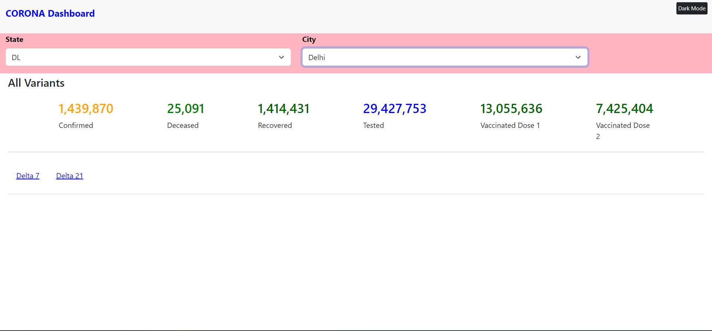
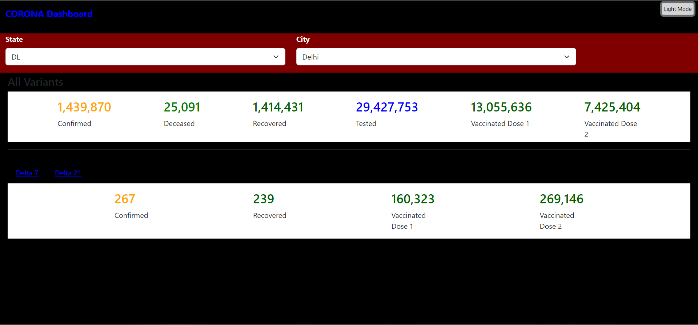

# Covid-19-dashboard
Covid-19 dashboard created using ReactJS + Typescript.

***UI Components used : React-Bootstrap***

### Api Used : https://data.covid19india.org/v4/min/data.min.json

## How to run
1. Clone the repo
2. Run `npm install`
3. Run `npm start`
4. Open `http://localhost:3000/` in your browser
5. Check Covid 19 data for your state and district

## Screenshots

## Features
1. State wise data
2. District wise data
3. Search for a state
4. Search for a district
5. Dark mode